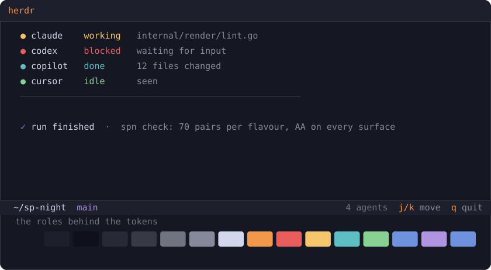
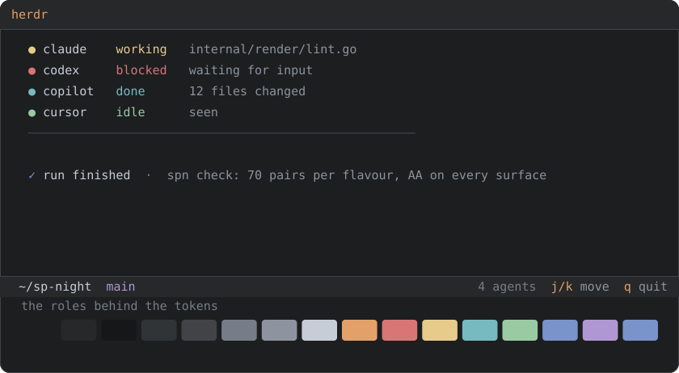
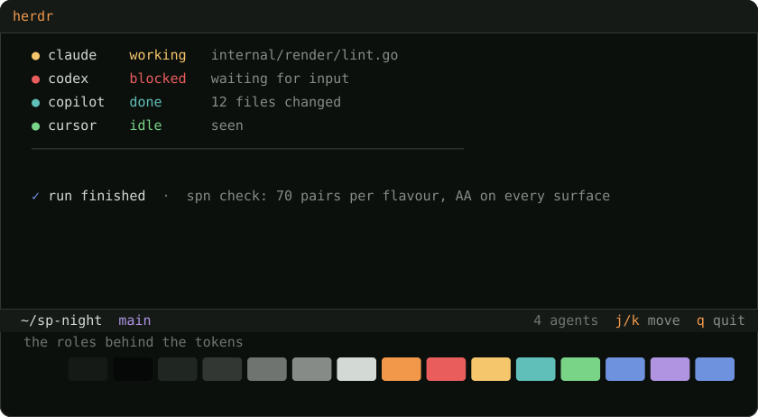

<p align="center">
  <a href="https://sp-night.github.io">
    
  </a>
</p>

<h1 align="center">SP Night for <a href="https://herdr.dev/">Herdr</a></h1>

<p align="center">
  <strong>The sodium lamp turns the whole city this colour.</strong><br>
  A dark colour scheme with São Paulo as its reference — the sodium street lamp,<br>
  exposed concrete, the free span of the MASP, the drizzle before the rain.
</p>

<p align="center">
  <a href="https://sp-night.github.io"><strong>sp-night.github.io</strong></a>
  &nbsp;·&nbsp;
  <a href="https://sp-night.github.io/palette">palette</a>
  &nbsp;·&nbsp;
  <a href="https://sp-night.github.io/spec">spec</a>
  &nbsp;·&nbsp;
  <a href="https://sp-night.github.io/ports">ports</a>
</p>

---

## The flavours

All three are dark, by decision. The previews below are synthetic — drawn from the
palette itself, so they can never drift from what you install.

### Noite Paulista — `sp_night_noite.toml`

The city at 3am. Blue-violet dark, the sodium lamp burning warm on top.



### Garoa — `sp_night_garoa.toml`

The same window, seen through the drizzle. Flat grey — the garoa does not cool
the city down, it washes it out.



### Pico do Jaraguá — `sp_night_jaragua.toml`

The same night, seen from the city's highest point. Near-black surfaces, with
the forest left to the accents — and the red-and-white tower lit at the summit.



## Install

herdr keeps everything in one file, `~/.config/herdr/config.toml`, and a
custom theme is a `[theme.custom]` table inside it. There is no theme file
to drop in and no `include` to point at one.

> [!WARNING]
> That means this port is **merged into** your config, not installed over
> it. Do not `curl -o ~/.config/herdr/config.toml` — that file holds the
> rest of your settings.

Open the flavour you want and paste its `[theme.custom]` block at the end
of your config:

```sh
curl -L https://raw.githubusercontent.com/sp-night/herdr/main/themes/sp_night_noite.toml
```

Then apply it without restarting anything:

```sh
herdr server reload-config
```

> [!NOTE]
> The block sets all seventeen tokens herdr exposes, which is every field
> of its internal palette — so whatever `theme.name` you have stays
> irrelevant and no colour leaks through from the base theme.

## What gets themed

| `theme.custom` token | Role | Meaning |
|---|---|---|
| `text` / `subtext0` | `ui.fg` / `ui.fg_dim` | primary and secondary labels |
| `overlay1` / `overlay0` | `ui.fg_dim` / `ui.fg_muted` | the two quiet steps — `overlay0` also marks an agent whose state is unknown |
| `sidebar_bg` | `ui.panel` | the sidebar is permanent furniture, so it sits on exposed concrete |
| `panel_bg` | `ui.float` | modals and overlays drop to the *vão*, separating by depth rather than by a border |
| `surface0` / `surface1` | `ui.selection` / `ui.line` | the selected row in *vidro*, the merely active one a step below |
| `surface_dim` | `ui.border` | *fiação*, the wiring between panes |
| `accent` | `ui.accent` | the focused border, in *sódio* — the lamp this whole palette is named for |
| `red` / `yellow` | `diagnostic.error` / `diagnostic.warn` | an agent Blocked, an agent Working — the two you look for first |
| `teal` / `green` | `diagnostic.hint` / `diagnostic.ok` | finished and not yet seen, then finished and acknowledged. herdr distinguishes the two, so the theme does |
| `blue` | `diagnostic.info` | the toast that says a run finished |
| `mauve` | `syntax.type` | branch names and the special labels beside them |
| `peach` | `ui.accent` | set for completeness. herdr defines it in every built-in theme and accepts an override, but nothing in the interface paints with it today |

No hex in this repo was picked by hand. Every value comes from the
[SP Night palette](https://sp-night.github.io/palette) through its role layer,
both published as data:
[`palette.json`](https://sp-night.github.io/palette.json) and
[`roles.json`](https://sp-night.github.io/roles.json). The contrast floors those
colours have to clear are [written down in the spec](https://sp-night.github.io/spec)
and enforced in CI.

## The mapping

[`herdr.toml.tmpl`](herdr.toml.tmpl) is the full record of which `theme.custom` token means which
role — the table above in complete form. The files in
[`themes/`](themes) are what it resolves to, one per flavour.

You never need it to use the theme: the shipped files are plain text and final.
It is here so the mapping survives, and so a retuned palette can be rolled
through this port without anyone re-deciding what the four agent-state colours mean.

## License

[MIT](LICENSE)
